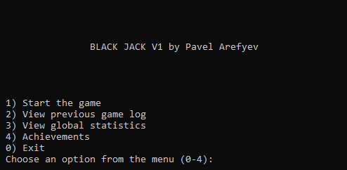
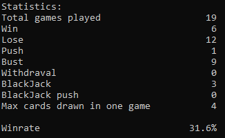
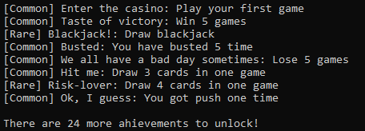

# BlackJack

## About
BlackJack is my first gamedev-about experience and my first C project. It as a console-based application that allow you to have fun in ultra-retro style (achievements included). The functionality of the application includes:

1. Fully functional blackjack game with the rules of European casino
2. Previous games log/global statistic
3. Achievements
4. Modern design 

## Statistics
In-game statistics will help you track your progress and compare skills with friends. Winrate, rare-case deals and much more in a simple table.

## Achievements
There are 32 challenging achievements in total. It takes about 20 hours to unlock them all.

Additional information and technical documentation may be found in UserMannual.pdf.
